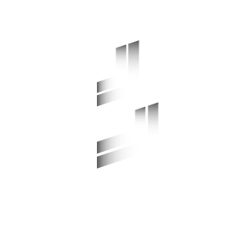
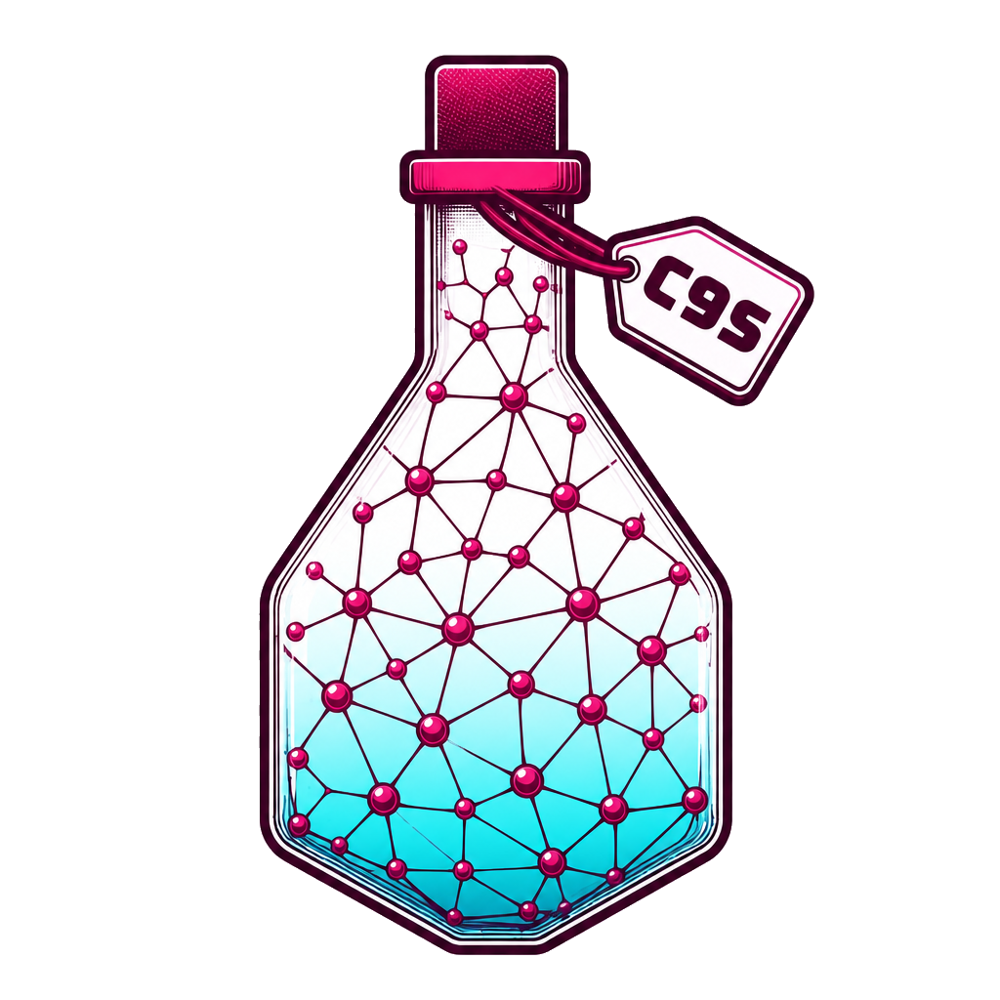

<div class="boxen-hero" markdown="1">
<div class="boxen-hero-copy" markdown="1">
<p class="boxen-eyebrow">VIRTUAL MACHINES. CONTAINER WORKFLOWS.</p>

# Network operating systems.<br> Neatly boxed.

Boxen turns a network OS virtual machine into a portable container image. Bring a vendor disk and a YAML profile; Boxen handles the first boot, prepares the operating system, and packages it for your next [**Containerlab**](https://containerlab.dev/) or [**c9s**](https://c9s.run/) lab.

[Get started](installation.md){ .md-button .md-button--primary }
[See how it works](architecture.md){ .md-button }

<p class="boxen-hero-note">Written in Go · Driven by YAML · Built for network labs running on Containerlab or c9s</p>
</div>
<div class="boxen-hero-brand">
  
  <p class="boxen-designed-for">
    Built for
    <a href="https://containerlab.dev/" title="Containerlab"></a>
    and
    <!-- c9s artwork: https://c9s.run/assets/c9s-logo-clean-BmWabNFD.png -->
    <a href="https://c9s.run/" title="c9s"></a>
  </p>
</div>
</div>

## Boxen packs a network OS VM into a container image.

The container still runs QEMU VM inside, there is no way around it, however by packaging it in a container, you get a familiar way to store, distribute, and launch it. Boxen automates the packaging process and handles everything Containerlab or c9s needs to successfully boot and run the image.

<div class="boxen-flow" markdown="1">
<div markdown="1">
<span class="boxen-number">01 / DEFINE</span>

### Describe your box

A [profile](profiles/structure.md) defines the VM hardware, boot prompts, baseline configuration, and runtime steps. Start with an included profile or adapt one for your platform.
</div>
<div markdown="1">
<span class="boxen-number">02 / PACKAGE</span>

### Prepare it once

[`boxen build`](guides/packaging.md) starts a builder, converts the disk to QCOW2, boots the OS, and saves a prepared disk and profile in a local container image.
</div>
<div markdown="1">
<span class="boxen-number">03 / RUN</span>

### Make it a lab

[Containerlab](guides/running.md) starts your image. Boxen boots QEMU, connects the interfaces, applies the node configuration, and reports readiness.
</div>
</div>

<div class="boxen-command" markdown="1">
<span class="boxen-number">YOUR FIRST IMAGE</span>

```sh
boxen build --disk /path/to/cumulus-linux-5.16.1-vx-amd64-qemu.qcow2 \
  --profile nvidia_cumulusvx --tag 5.16.1
```

The result is `boxen-nvidia_cumulusvx:5.16.1`. Point your topology at that image and deploy. The [quick start](quickstart.md) walks through the complete workflow.
</div>

## Boxen vs VRnetLab

Boxen and [VRnetLab](https://github.com/srl-labs/vrnetlab) both package network OS virtual machines into container images. Boxen puts the preparation and runtime instructions in YAML profiles, with a common architecture across network OSes.

<div class="boxen-flow" markdown="1">
<div markdown="1">

<span class="boxen-number">01 / YAML PROFILES</span>

### Low code approach

Describe how to prepare and run an image in a [YAML profile](profiles/structure.md). Every supported network OS uses the same architecture and shared runtime.
</div>
<div markdown="1">

<span class="boxen-number">02 / CLI RUNNER</span>

### Intuitive CLI runner

Build, package, and run images through a consistent CLI with clear flags and built-in help. [Load and share](guides/images.md#move-an-image-without-a-registry) the resulting images with familiar Docker commands.
</div>
<div markdown="1">

<span class="boxen-number">03 / CUSTOM OS</span>

### Decoupled build process

Add a custom OS with a [single YAML profile](profiles/authoring.md) and pass it to `boxen build --profile`. Keep and iterate on your profile locally; no pull request or upstream merge is required.
</div>
</div>

## Everything you need to build the next lab

<div class="boxen-guides" markdown="1">
<div markdown="1">

### Get up and running

[Installation](installation.md) covers the Linux host, Docker, KVM, and the Boxen binary. Follow the [quick start](quickstart.md) to package an image and deploy two nodes.
</div>
<div markdown="1">

### Understand the lifecycle

Learn the [packaging process](guides/packaging.md), the [run process](guides/running.md), and how [management networking](guides/management.md) reaches the guest.
</div>
<div markdown="1">

### Make a profile your own

Explore the [profile structure](profiles/structure.md), [console steps](profiles/steps.md), [template values](profiles/templates.md), and [QEMU configuration](profiles/qemu.md).
</div>
<div markdown="1">

### Keep your images useful

[Manage images](guides/images.md), share them through a registry, refresh the runtime without repackaging, and [troubleshoot](guides/troubleshooting.md) boot or connectivity issues.
</div>
</div>

Boxen is under active development. Check the [included platforms](platforms.md) for profile-specific requirements and join the [Containerlab community](https://discord.gg/vAyddtaEV9) to discuss new platform support.
